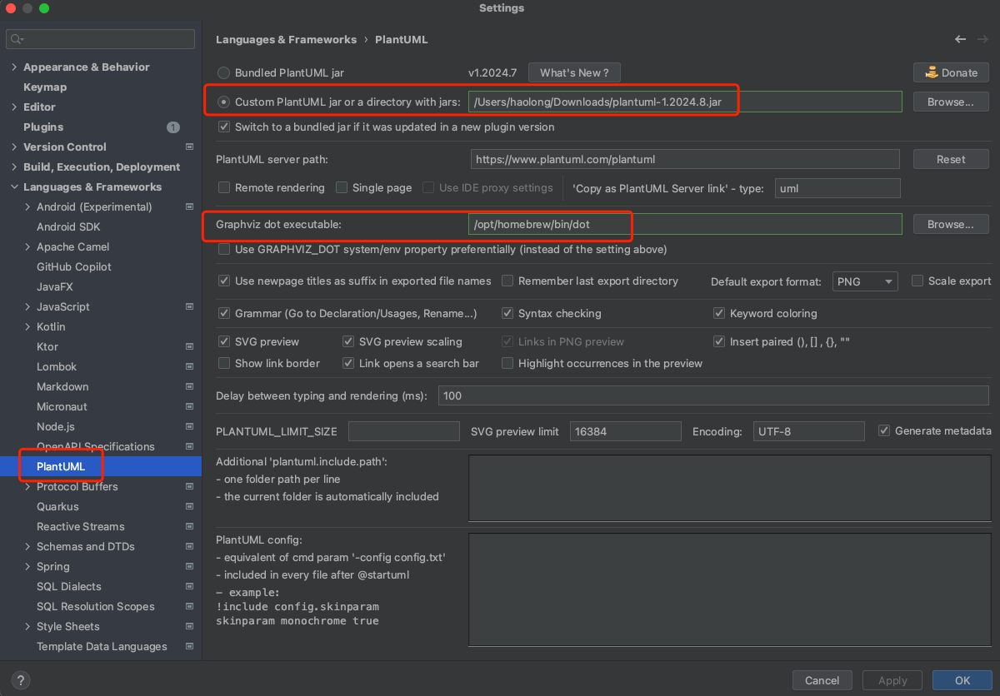
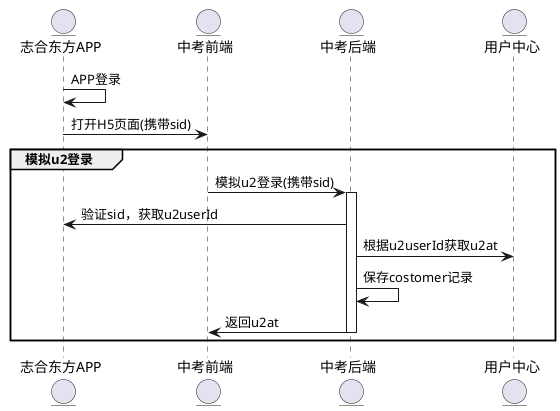
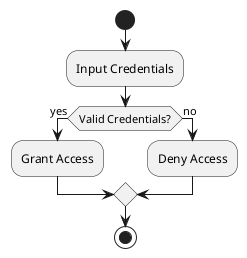
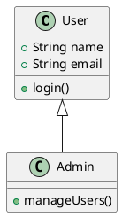
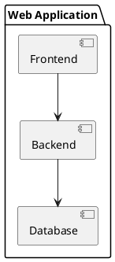
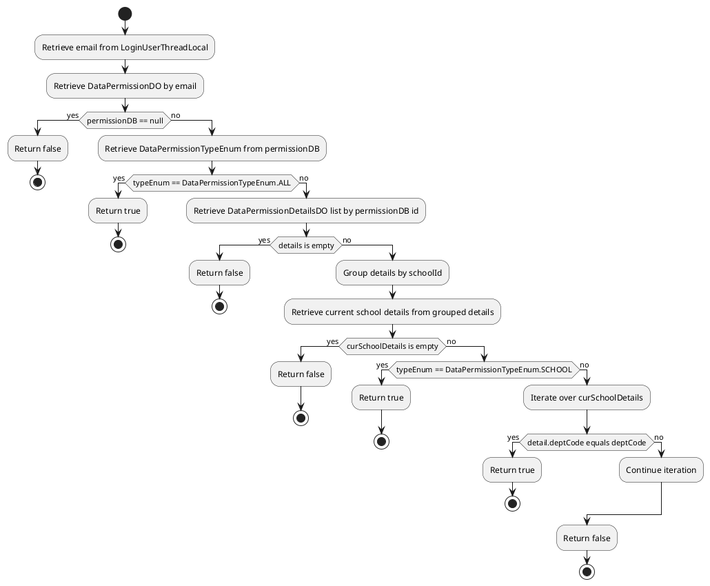
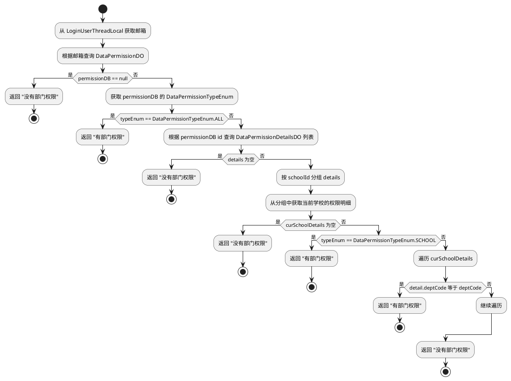
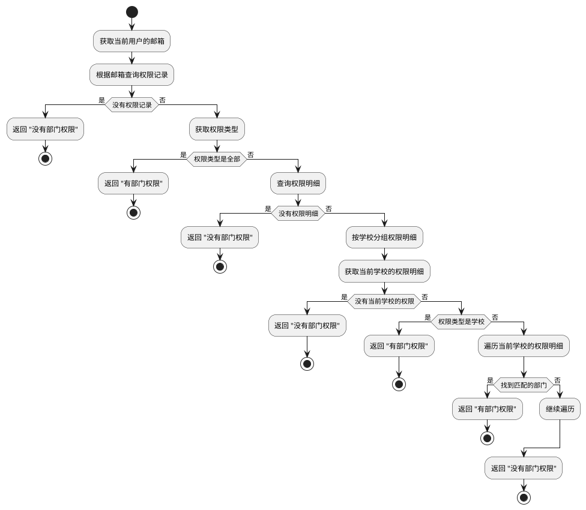
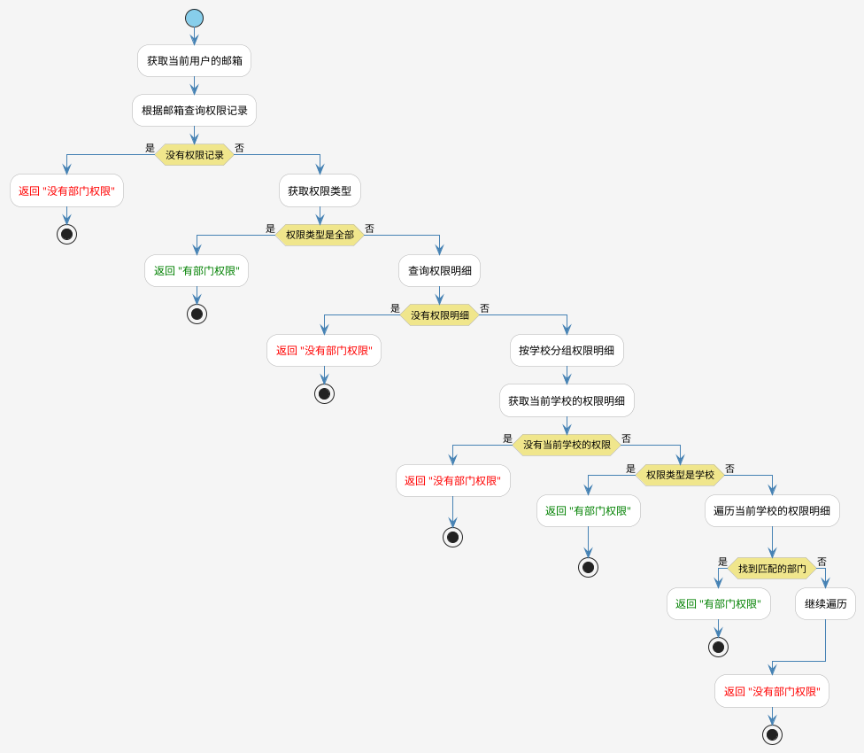

# PlantUML 经验分享

## 1. 简单介绍 PlantUML

**PlantUML** 是一种基于文本描述的图表生成工具，支持多种 UML 图表类型，包括时序图、类图、活动图和组件图等。它通过简单的代码描述生成专业的图表，尤其适合程序员在软件设计和文档编写中使用。

### **PlantUML 的主要特点**
- **简单高效**：使用纯文本语法描述图表，省去了手动绘图的繁琐步骤。
- **易于版本管理**：基于文本格式，方便在版本控制工具中进行追踪和协作。
- **强大的集成能力**：支持多种 IDE（如 IntelliJ IDEA）和工具（如 VS Code）。
- **支持多种图表类型**：时序图、类图、活动图、组件图等多种 UML 图表类型。

---

## 2. 快速体验

### 2.1 在线体验
搜索引擎搜索 **PlantUML 在线工具**，可以找到很多在线工具，例如 [PlantText](https://www.planttext.com/)。
输入以下示例代码，即可生成时序图:
   ```plantuml
   @startuml
   Alice -> Bob: Hello
   Bob -> Alice: Hi
   @enduml
   ```


### 2.2 在IntelliJ IDEA中使用 PlantUML（MacOS环境）

#### 步骤 1：安装Graphviz
   1. 使用 Homebrew 安装 **Graphviz**：
   ```bash
   brew install graphviz
   ```
   2. 执行如下命令，如果安装成功，将显示版本号。
   ```bash
   dot -version
   ```
 
   3. 执行如下命令， 记住安装路径，例如：`/opt/homebrew/bin/dot`。
   ```bash
   which dot
   ```

#### 步骤 2：下载 **PlantUML JAR 文件**：

   1. 前往 [PlantUML 下载页面](https://plantuml.com/download)。
   2. 下载 `plantuml.jar` 文件并保存到固定目录，例如：`~/tools/plantuml.jar`。

#### 步骤 3：在IntelliJ IDEA中，安装 PlantUML 插件
1. 打开 IntelliJ IDEA。
2. 进入 **File > Settings > Plugins**。
3. 搜索 **PlantUML Integration**，点击 **Install** 安装插件。
4. 安装完成后，重启 IDEA。

#### 步骤 4：在IntelliJ IDEA中，配置 PlantUML 插件
{width=60%}


#### 步骤 5：在IntelliJ IDEA中，创建并运行 PlantUML 文件
1. 在项目中创建一个 `.puml` 文件，例如：`example.puml`。
2. 输入以下代码：
   ```plantuml
   @startuml
   Alice -> Bob: Hello
   Bob -> Alice: Hi
   @enduml
   ```
3. 右边会显示生成的图表。

---

## 3. 使用案例介绍

### 3.1 时序图

#### 3.1.1 多系统对接时，通过plantUML快速生成时序图，提高沟通效率
{width=40%}
具体代码如下：

#### 3.1.2 梳理现有系统的调用关系，通过plantUML生成时序图，方便理解


---

### 3.2 活动图
活动图描述动态流程。以下是一个简单的活动图代码：


---

### 3.3 类图
类图展示类及其之间的关系。以下是一个简单的类图代码：


---

### 3.4 组件图
组件图展示系统中的组件及其相互依赖关系。以下是一个组件图的示例代码：


---

## 4. 与 AI 工具的结合

### 4.1 GitHub Copilot 
结合 **GitHub Copilot**，可以更快地生成 PlantUML 代码，以下是一个真实工作场景，用于生成[中考志愿技术文档](https://alidocs.dingtalk.com/i/nodes/AR4GpnMqJzMLzPPoio049KR9VKe0xjE3?iframeQuery=utm_source%3Dportal%26utm_medium%3Dportal_recent&rnd=0.2049844496574701)中的权限判断流程图。
首选在idea中打开copilot，如下图所示：

- **首次请求**，生成的plantUML代码如下：


- **"要求中文输出"**，再次请求，生成的代码如下：

- **"假设这个图是给非程序员看的，在不改变业务逻辑的前提下，简化一下"**，再次请求，生成的代码如下：

- **"使用不同配色突出返回有权限和无权限的节点，要求配色优雅简洁"**，再次请求，生成的代码如下：


---

## 5. 总结优势

**PlantUML 的主要优势**：
1. **高效**：通过简单的文本描述快速生成图表，节省时间。
2. **灵活**：支持多种 UML 图表，满足多种设计需求。
3. **易集成**：可以集成到各种 IDE 和工具中。
4. **版本管理友好**：基于文本格式，方便协作和版本控制。
5. **结合 AI 提升效率**：与 ChatGPT 和 Copilot 配合使用，可以快速生成所需的图表代码。

PlantUML 是一个强大且灵活的工具，非常适合程序员在设计、开发和文档编写中使用！
