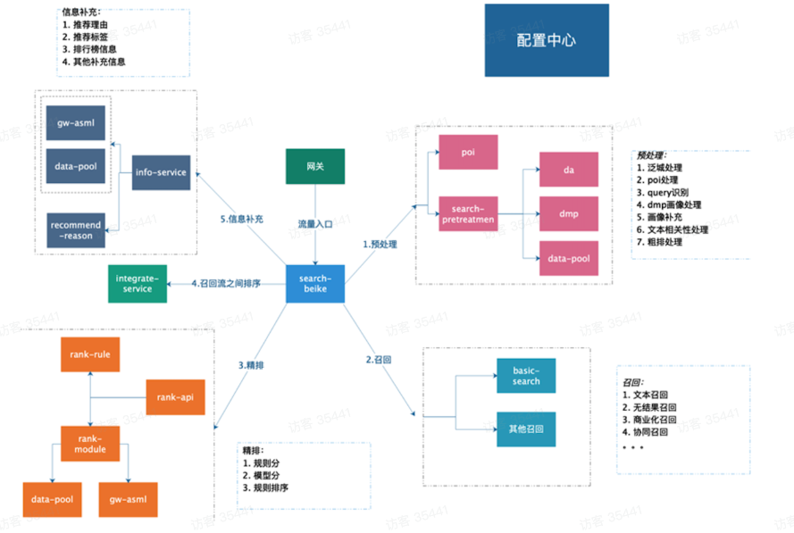

# 架构概览


我们按照数据处理流程来看, 依次经过 API层、统一网关、混推、中控、意图、召回、精排、重排、理由各环节,与业内的差异不大

先介绍通用部分:
- 意图: 主要是对 query 词的解析;例如 我们输入“西二旗整租,会提取出“西二旗"、"整租 "两个标签  
BE: 核心作用在于解决信息过载,控制召回数量及保障物料构成多样性,为后续精排环节减负.  
排序: 主要分为粗排和精排.对应的方法无非规则、机器学习和深度学习几种;

- 粗排:一般使用的是业务规则,核心在于逻辑简单,效率高.

- 精排:一般使用的是机器学习、深度学习;远辑复杂,准确性/转化率高.
展示规则:主要用于打散,卡位排布,保证物料多样性同时,关注用户体验

再介绍贝壳特有部分:
- API 作为交互层,处理用户的请求 混推层:负责多物料异构融合,保证物料多样性和策略多样性
- 中控层: 负责对下游各模块进行调度及接口参数校验.在稳定性方面,必须对各模块有降级和兜底,避免空白页的情况;
- 数据服务:
  - 涉及房源物料 、用户画像 和 模型特征
  - 存储选型上,基于文本分词匹配和聚合查询的场景,把房源数据维护在es 索引中;
  - 基于性能考虑,模型特征数据维护在 redis 中;
- 模型服务：依赖公司基于tf-serving 自建平台,使用grpc 调用
  

基础组件:
- 采用SpringCloud 框架
- 使用eureka服务注册发现
- 服务间通过feign进行http调用
- 网关使用zuul,进行降级限流;二次开发后,融合abtest 打标,数据降级等;

部署上是按照业务线纬度独立部署,代码复用
整体已经实现配置化迭代,操作灵活.后面重点介绍.

# 架构如何设计?

我们以贝壳搜索架构和迭代来分析



## v1.0 搜索架构

早期贝壳搜索架构,微服务拆分的过于细,整理流程可以概括为"调度中控预处理> 召回>精排>融合 > ABH”,
在每个环节都有3个及以上的微服务.我们暂且称之为第一阶段。

为了支撑贝壳旗下各类C端产品如 二手房、新房、租房、装修、商业地产、海外地产等的快速迭代,每条业务线都有一套同样的架构,微服务应用超过50+,数量整体超过200多个.而此时负责工程迁代的开发人员仅有4个人.这时候存在的问题显而易见

- 微服务数量与开发人员数量不对等,导致个人开发效率不高,测试部署占据大量时间
- 各业务线功能基本类似,系统优化/问题修复需要逐个解决;差异部分靠硬编码处理,扩展性极差
- 服务链路过长,导致束体性能很差'微服务间少/无熔断降级,稳定性很差,大家都瘦于救火

### 搜索架构整合

首先进行逻辑梳理,进行整合,使多业务线共用同一套架构,这一步将核心应用数量缩减到7个,依次为 1中控、2.预处理、3.召回、4 .规则排序、5.模型排序、6.多流融合、7.信息补充

间接依赖: 意图NLU 解析、用户画像、es-api服务、模型网关 等


注意看,这里已经和业内经典的抽象逻辑单元一一对应上

有做意图的预处理、负责多样性物料的召回、规则粗排序、模型精排序、异构融合展示、用于丰富内容的信息补充.基本上做到了应用单一指责. 也提升了开发人员、测试人员的工作效率.

### 配置化迭代

针对不同业务线,届辑差异的问题,我们设计了搜索云平台(同业内实现类似:例如阿里开源的Nacos )设计通用配置模版,解决功能差异;同时基于上方微服务架构,实现了功能配置化,如下图


我们对场景标识(以下称场景id),配置其对应的 预处理、召回、排序、融合、理由 各环节的策略逻辑,举例如下:

```json
{
  "服务配置": {
    "场景配置": {
      "商品策略图": {
        "AB实验流量": [
          "all"
        ],
        "访客频度": [
          "all"
        ],
        "用户群组": [
          "all"
        ],
        "部分场景策略": [
          "all"
        ]
      }
    },
    "处理过程": {
      "black-list": {
        "isOpen": false
      },
      "重排": {
        "isOpen": true
      },
      "NLU": {
        "扩权": {
          "城市": [
            "all"
          ],
          "访问频度": [
            "all"
          ],
          "用户群组": [
            "all"
          ],
          "部分场景策略": [
            "all"
          ]
        },
        "isOpen": true
      },
      "预处理": {
        "扩权": {
          "城市": [
            "all"
          ],
          "访问频度": [
            "all"
          ],
          "用户群组": [
            "all"
          ],
          "部分场景策略": [
            "all"
          ]
        },
        "isOpen": true
      },
      "召回": {
        "isOpen": true
      },
      "理由补充": {
        "isOpen": false
      },
      "多流融合": {
      }
    },
    "特征配置": {
    },
    "引用名称": {
      "商机排序": "effect-ranking-rent-V3",
      "人工干预策略": "manual-intervention-platform",
      "es-api": "search-v2",
      "理由流": "effect-reason",
      "召回流": "effect-recall-rent-V3",
      "重排流": "effect-rerank-rent-V3"
    },
    "eurekrak": {
      "client": {
        "healthcheck": {
          "enabled": true
        }
      }
    },
    "外部依赖配置": {
      "url": "http://zeus-nlu-search.test-nlu-search.cto.test.ke.com/zeus/nlu/v1.0"
    },
    "service": {
      "显房开发": {
        "id-generator": true,
        "basic-search": true,
        "effect-page": false,
        "effect-reorder": true,
        "nlu-analysis": true,
        "effect-rank": true,
        "multi-city": true,
        "effect-recall": true,
        "aggregation-service": true,
        "effect-reason": true
      }
    },
    "线程池配置列表": {
      "effect-remote": {
        "keepAliveTime": 10,
        "queueSize": 100,
        "coreSize": 150,
        "maxSize": 250
      },
      "effect-common": {
        "keepAliveTime": 10,
        "queueSize": 100,
        "coreSize": 200,
        "maxSize": 250
      }
    },
    "场景策略": {
      "功能开关": {
        "城市检索": true
      },
      "业务线类型": "租房",
      "HERI": 950,
      "RRA": 180,
      "channelId": "zufang",
      "物料主键": "coded",
      "field-mapping": {
        "districtId": "districtId",
        "bizcircleId": "bizcircleId"
      }
    },
    "请求时间限制": {
      "effect-remote": 500,
      "basic-search": 200,
      "effect-reorder": 100,
      "nlu-analysis": 100,
      "effect-rank": 200,
      "effect-recall": 400,
      "force-check": 500,
      "aggregation-service": 300,
      "effect-reason": 350
    },
    "链接时间限制": {
      "effect-remote": 500,
      "basic-search": 200,
      "effect-reorder": 100,
      "nlu-analysis": 100,
      "effect-rank": 200,
      "effect-recall": 400,
      "force-check": 500,
      "aggregation-service": 300,
      "effect-reason": 350
    },
    "remoteCity": {
      "m": "m"
    },
    "服务预热": {
      "preheat": {
        "requests": [
          {
            "headers": {},
            "body": "",
            "uri": "api/1012810002/search"
          }
        ],
        "enabled": false
      }
    },
    "降级数据": {
      "redis": {}
    },
    "降级开关": {
      "open": {
        "bs": true,
        "core": false
      }
    }
  }
}
```

这样,我们就把各个模块按照场景进行编排组合,并通过开关进行热插拔,通过配置变更进行修改.
而日常功能迭代,也基本上都是进行配置修改. 行文至此,再介绍下 这个平台的架构设计


## V2.0 搜索推荐架构统一
随着架构功能逐步完善,适代流程更加规范;我们希望架构能够做的更加通用、灵活,适配更多场景

考虑到公司搜索、推荐在工程上存在极大的通用性,出于降本提效的目标(工程专注稳定性、算法专注策略迁代),我们
进行了搜索、推荐的架构整合(见下图).


乍一看这架构,着实让人头疼,找不到很好的切入点

搜索架构在第一阶段已经做过整合抽象,按照单一职责进行微服务拆分,而推荐采用传统的三层架构,逻辑主要集中在计算层(召回、排序、融合三部分功能).依赖数据层进行物料特征获取,模型层进行模型预估.应用层对应业务规则和展示规则.

架构统一,难点有三

1. 推荐场景繁多,且对接口耗时有强要求
2. 服务抽象设计难度大,推荐架构与搜索架构差异很大
3. 整合周期长,缺少智能工具和自动脚本提效

### 中控层(流程编排)
中控层在不同场景下,基于配置进行模块间调度;核心在于稳定性方面的设计,保证匹配的同时,又要最大程度的保证业
务效果.

流程如下图


链路超时控制
目标在于,满足规定的响应时间内,尽可能的保障效果.

设计思路

© *okhttp (Hitz
* 主要修正fegin请来breadTimeOut
*T、remainTimeOut 动态计算超采厅间
*2、合用时认配置的最大超上8加
*3, BUTTER ARIES
* Example:
* 8       totalTimeOut = 900ms , releaseTime = 900ms
* 8—4H recall maxTimeQut = 500ms < 900ms , readTimeOut = 500ms, costTime = 200ms, releaseTime =
900-200 = 700ms
* =H rank _maxTimeOut = 300ms < 700ms , readTimeOut = 300ms, costTime = 300ms, releaseTime =
700-300 = 400ms
*第三步reoreder maxTimeOut = 500ms > 400ms , readTimeOut = 400ms, costTime = 600ms, costTime >
readTimeOut 超肝失败
* 第四步info maxTimeOut = 100ms > 0ms , FH RATATAT NER
* 最终返回敌二步的结黑

多层降级模块
结合链路超时设计,依次按照效果损失程度,进行5种进行降级处理
1. 策略召回+排序+重排
2. 策略召回+ 排序
3. 策略召回
4. 基础检索
5. 缓存兜底

### (依赖)2.意图模块


利用基础NLP能力，对我们的用户输入的Query进行分析，产生一系列的基础信号，然后这些信号会应用到整个搜索
链路的召回、排序等各个阶段。

我们重点借鉴下 实体识别、实体链接2部分


实体识别的整体框架，主要分两个部分: 下面的离线端和上面的在线部分。

线上的识别来源主要分两部分，一部分是词典的实体匹配，一部分是模型预测，然后再往上是消歧策略，实体词典匹
配，主要解决一些热门和词库里能够匹配的词，对一些长尾和泛化的词识别，还是依赖于模型。但是这两个部分中间
的结果可能会有一              歧策略，包括多粒度、多结果选择。我们主要通过一些模板规则，进行优
先级的消歧，最终输出一个多路的结果，因为某些query会有粒度和类别的歧义。

离线部分主要是两个大的部分: 一部分是实体挖掘，这个主要是为线上的实体匹配提供基础的实体库，模型方面主要
是一些基础的模型训练、优化相关的工作。

实体链接 - 整体框架


离线的部分，其核心是对所有物理实体mention的挖掘，其实就是实体的一个别名，用来扩大实体链接召回。

线上部分，首先通过别名进行实体召回，然后对召回的实体进行消歧排序。消上岐主要结合Query文本序列的特征、基
于地理位置的特征 (比如城市和GeoHash) ，还有上下文的一些文本信息进行消岐排序，返回给用户最相关的Top实
体。

设计电路
1) 基础能力: 模位提取、业务线识别
2) 业务指标: 无结果率 & PCTR & PCVR 、站内PCTR&商机转化率; 站外用户拉端率

系统架构


执行流程


多路召回


按需提取
槽位标签中,会基于不同业务维度提供对应的标签 和 置信度

json

```json
{
    "community": {
        "action": "FILTER",
        "threshold": 1,
        "Fields": "hdicResblockId"
    }
}
```


### (依赖) 3.数据录入

数据流服务是负责业务检索数据的写入，主要支持两种写入方式:
© 服务器拉取 (pull): mysql binlog监听写入
+ 客户端推送 (push): 提供写入API，业务方自写入


### 召回层(同构融合)
01 流程分析


综合搜索推荐的召回功能进行抽象,整体划分为三个阶段: 依次为召回前、召回中、召回后;

#### 4.1.召回前
召回前,主要涉及 基于NLP的意图识别、基于用户画像和策略的请求改写等功能,我们参照业内其他公司的设计,定义
了 意图解析模块(上方),画像解析模块,策略调权模块
用户画像模决
相关设计不做疯述,这里只介绍贝壳对于的标签调权


```json
{
"rent_period": {
"FieldName": "lease",
"size": 2,
"name": "rent_period",
"action": "range",
"weight": 150
},
"subway_line": {
"FieldName": "subwayLineId",
"size": 2,
"name": "subway_line",
"action": "match",
"weight": 50
}

}
```

策略调权模块

相对其他电商公司,贝壳找房设计了策略调权模块


标量过滤

```json
{
  "or4": [
    {
      "field": "expoCnt",
      "action": "lte",
      "value": "0"
    }
  ],
  "or3": [
    {
      "field": "sjScore",
      "action": "lte",
      "value": "0"
    }
  ],
  "or2": [
    {
      "field": "appSourceBrand",
      "action": "terms",
      "value": "1313"
    }
  ],
  "or1": [
    {
      "field": "appSource",
      "action": "terms",
      "value": "123,2123,20123"
    }
  ]
}
```
策略调权
```json
{
  "sorts": [
    {
      "field": "sjScore",
      "order": "asc"
    },
    {
      "field": "expoCnt",
      "order": "asc"
    },
    {
      "field": "_score",
      "order": "desc"
    }
  ]
}
```


### 4.2 召回中
工程实现上,贝帝搜索、推荐两套系统,均将房源数据维护在 es 索引 中,以租赁业务为例
目前使用的是 条件过滤、画像召回、特征召回、距离扩召回 四种;
搜索侧由于仅依赖es索引,通过服务注册发现,调用 es集群对应的api 服务;
推荐侧涉及多数据源(es、redis、hbase、api),为了做到解糯和复用,独立设立了数据层服务,以策略标识方式,区分不同数据源的物料获取.


### 4 .3 数据层的设计

考虑到多样性召回 和 代码复用性,我们采取推荐侧的设计,把物料获取的功能独立出来,放在数据层实现;同时做好对应
的缓存、降级处理. 后来在异构融合场景架构设计时,也进一步验证了数据层设计的必要性


4.4 召回后
召回后主要负责两大部分功能: 业务调权、策略融合,都在应用内存中处理
业务调权
使用groovy脚本,结合配置平台实现


融合部分


4.5配置化
我们再看下如何使用配置完成这三部分功能的关联


具体配置

```json

{
  "服务配置": {
    "场景配置": {
      "1013901005": {
        "ab_name": {
          "1013901005-ab_name-ab_group-default": {
            "blackIdList": [],
            "recallRule": {
              "quantityControl": {
                "recallInfoList": [
                  {
                    "recallId": "21000016"
                  },
                  {
                    "recallId": "21000023"
                  },
                  {
                    "recallId": "21000008"
                  },
                  {
                    "recallId": "21000010"
                  },
                  {
                    "recallId": "21000022"
                  },
                  {
                    "recallId": "21000017"
                  }
                ]
              }
            },
            "mergeRule": {
              "quantityControl": {
                "mergeControlList": [
                  {
                    "mergeType": "normal",
                    "name": "moo4",
                    "weight": {
                      "21000008": 11,
                      "21000010": 1,
                      "21000016": 1,
                      "21000017": 1,
                      "21000022": 4,
                      "21000023": 11
                    }
                  }
                ]
              }
            }
          }
        }
      }
    }
  }
}
```

物料的多样性,就意味着召回形式的多元化 和 多模态.
贝壳目前已实现如下召回形式

。 文本召回(短query词)

。 标量过滤(各类筛选条件)

+ 商业化召回(CPT、CPA类)

。 策略指标召回(低商机、低曝光房源)

* 个性化召回(基于用户偏好,类似推荐)

。 向量化召回(基于用户行为embedding)

。 短视频找房
。 直播找房

模态对应物料由运营侧 和 如视平台(贝壳子公司) 提供,召回形式也都基于当前架构进行请求改写、扩充;
重点介绍下

4.6向量召回
提升召回率

1、由于目前的推荐策略更多用以|21和规则类为主 (偏历史) ，向量化检索可以将召回策略模型化，显著提升召回
策略的预测能力,提高召回率后间接作用于过程指标商机量.

2、户型这种物料，天然就是使用向量而非文本描述，所以必须依赖向量检索能力来实现检索召回。
向量调研
采用哪种向量引擎,对比如下

其中，Faiss 和 SPTAG 只是核心算法库，需要进行二次开发包装成服务; Milvus 的 1.x 版本中只能存储id 和 向量，
不能完整的满足我们的使用需求,新版milvus支持标量过滤，内部使用bitmap实现，但性能不高;基于集群稳定性和
可维护性等考虑，相对于后置插件的部署，更倾向使用 ES({v7.6.2) 的原生功能


```json
{
  "embedding": {
    "type": "dense_vector",
    "dims": 32
  },
  "size": 100,
  "query": {
    "script_score": {
      "query": {
        "bool": {
          "filter": [
            {
              "term": {
                "cityId": {
                  "value": "320500",
                  "boost": 1
                }
              }
            }
          ]
        }
      },
      "script": {
        "source": "l2norm(params.query_vector, 'vectorEmbedding')",
        "lang": "painless",
        "params": {
          "query_vector": [
            -0.0228145,
            0.170765,
            "...",
            -0.80648327
          ]
        }
      }
    }
  }
}

```


性能报告
数据总量204w,标量过滤后12w左右,32维特征
1. QPS 1500
2. Avg Tims, tp99 33ms
3. CPU 3%


5.排序层
从工程视角,排序层首先需要保证稳定性和效果无损.

效果无损的核心依赖是统一模型的迭代，即使架构迁代了也不会有任何影响，所以重点更多的应该是放在统一模型以及特征构建上.


存在问题:

1特征变换离线在线也是两套，离线使用PySpark，在线使用Java
2数据源线上线下其实是两套，离线特征是通过从Hive表中追湖
特征变换优化


改造内容

1. 统一线上线下特征变换，将特征变换抽成单独的模块

2. 以线上特征变换为基础，使用Java实现特征变换模块

3. 线下使用Spark，因此将Java语言的特征变换算子封装成Spark SQL可以使用的UDF函数
4. 同时，我们还对配置文件也进行了对齐，使得线上线下使用同一套特征变换的配置文件(一个模型的特征变换配置文件一般几百行)

```yml
Workflow:
  - sample_mark:
      check:
        cols: ["label", "location", "request_id"]
        function: position_mark_after_max_click_position
        params:
          cols_params:
            basic_position_col: "label"
            expo_position: "location"
            request_id: "request_id"
          return_field: "topN_position_mark"

  - sample_filter:
      check:
        cols: ["topN_position_mark"]
        function: sample_filter
        params:
          cond: "$topN_position_mark<=6"

  - sample_sampling:
      check:
        cols: ["label"]
        function: random_down_sampling
        params:
          label_tag:
            sample_label: "$label == 0"
            basic_label: "$label == 1"
          sample_rate:
            sample_label: 8
            basic_label: 1
          sample_seed: 0
          log_switch: True

  - sample_merge:
      check:
        group_field: ["user_id", "item_id"]
        function: merge_with_count_threshold
        params:
          cond: "$label == 1"
          threshold: 1

  - sample_mark:
      check:
        cols: ["label_type"]
        function: cond_weight
        params:
          sample_weight:
            sample1:
              cond: "$business_label == 1"
              weight: 10
          default_value: 1
          return_field: "cvr_weight"

  - sample_operator:
      function: sample_shuffle

  - sample_operator:
      function: select
      params:
        cols: ["request_id", "user_id", "city_id", "fb_expo_id", "item_id",
               "location", "label_type", "business_label", "label",
               "cvr_weight", "req_source", "service_id", "ts", "client_os_type", "pt"]
        SaveConf:
          saveType: hdfs
          format: parquet
          path: "/user/search_reco/reco/reco_rank_model/user_test/sample/{dataset_type}/{pt}"

```


搭建排序框架
为什么要改造流程
> 工程架构部分
1. 迭代成本过高
同早期搜索架构设计一样,服务部署存在至少5套业务代码，开发成本巨大，极易造成线上逻辑不对齐的情况
2. 优化周期过长
功能不收敛 ,一处优化，应用到其它若干服务的周期过长。
3. 稳定性不健全
无法提供一体化的解决方案 服务比较分散，技术架构不一致，难以实现完善的监控、容错机制。
+ 数据链路部分
1. 数据迟消
原始数据通过 TH 的方式在构建训练集追溯，会存在不一致问题,例如用户画像特征在离线训练集中是关联前一天的Hive数据，但是这部分数据线上API一般是在下午2点左右更新数据，因此实际上2点之前线上使用的是T+2的画像数据
2. 数据变更无感知从Hive中获取的数据，需要依赖Hive到API的转换规则 比如用户画像数据以及二手房源特征数据等在从Hive到
API中存在转换逻辑，这部分需要对齐，上游变换无法感知
+ 配置改造
1. 现有配置不够统一，且比较分散 配置分为:特征工程配置、模型配置等，较为分散;离线、在线配置已经差异巨
大，不同服务间的配置差异也尤为明显


改造效果

1. 服务使用一套代码，面向多种协议提供服务。大幅提升迁代效率，同时可深入进行服务优化。

2. 在线、离线数据统一来自 API，统一线上线下特征数据来源，也就不存在特征追溯中的数据对不齐问题，同时也不
必感知Hive到API中数据变换规则的问题。

3. 在线、离线配置收口到一套配置、一套格式、一处配置解决所有模型问题。
4 . 提供完整的特征日志解决方案，减少线下改造特征带来的风险和成本。


6.重排层
重排层聚集于对精排结果的后处理,偏重展示规则和流量分配.


展示规则方面,主要是做同类型物料的打散;流量分配方面,主要是基于离线统计不同场景,物料所处卡位对应的转化率,进行分配.这里是借助效果评测工具进行操作

效果评测工具
目标是在策略线上应用前,能够直观看到变化,为运营 和 测试同学提升效率


功能预期:

1、效果诊断                  一一是否符合用户偏好(CTR 视角) ,是否符合商业化预期(CPT、CPA)
2、可视化管理各业务卡位配置 ”一一 根据阶段性核心指标干预流量分配

3、支持权重调节,干预房源排序 — 灵活调节 画像标签、房源标签,策略因子权重,呈现干预后效果
4 、支持多维度个性化配置 ”一一 设计多种流量玩法,给到城市总、圈经纬度,灵活进行玩法调整

5、支持AB 实验                一一 打通AB实验,根据页面调配的策略属性,运用到AB 实验中

6、按预期效果目标给出卡位配置组合建议     一一 进行商机预估,ROI 预测

能力展示
得益于此前架构设计的合理性,在流程中各环节补充对应详细数据,根据评测标识 :strategyld 获取评测结果


7信息补充

基于搜索架构,信息补充为一个微服务，而推荐的信息补充则在计算层中，故需将推荐和搜索的信息补充模块进行
合并.流程如下图


受限于房产重资产的属性,信息补充模块相对偏静态.这里介绍下这部分模块的规划设计

。 基于用户画像
。 基于用户的全场景行为构建中 /短期画像,根据各个画像的能力去进行内容的召回、排序决定信息出现的时机、展示的内容，是否高亮等
+ 基于策略体系

。 基于推荐理由类型指标体系，进行理由的整体治理，降低无效理由，增加理由命中，而非将理由当作信息呈现的一个载体


统一架构,在原搜索架构基础上,将 预处理模块、融合模块中粗排部分,整合到召回层(召回前)、将依赖服务(模型服务除
外)整合到数据层,融合模块中展示规则部分,放到重排服务里.

8 混推层(异构融合)
上述架构,能够解决同构物料对应的搜索场景,但针对异构融合场景,就会存在策略配置复杂(下方左图) 、调用繁琐的问题(下方右图).


为此,我们调研了美团搜索架构设计,设立了异构融合层 -- 混推层.


V 3.0 流量运营系统

业界各种互联网平台类产品,按功能可以对应到如下图中四象限，随着产品形态多元化发展，也苦遍存在单一产品对应多个子场景分类。如贝壳，整体属于交易类，偏LBS导航型，同时由于存在房源类型复杂、用户目标分散、业务流量扶持等，因此也有推荐型场景


供给侧(平台)流量分层

从供给侧出发，流量分层有两种不同视角。分别是去化目标视角 和 财务视角。
长线来看，业务应该以财务视角分配流量，系统能力支持一房一策，针对不同房源的单体利润、去化难度等配比不同
流量，实现全局最优.
短期来看，应该采用去化目标视角。业务还有持续的规模增长目标，系统能力也不具备一房一策的模型和数据能力，
因此需要以去化目标产出规则，规则驱动流量的局部调配，实现短期目标最优。

结果指标(财务)视角分层


基于此,我们跳出搜索单场景得束缚,站在商业运营视角,结合业务前端来重新审视这套架构


在中台视角,专注于技术底层,目标是打磨通用能力,完成精准匹配;
在业务视角,更关注与用户、平台、商品三方的共同收益,具体分为3部分:流量运营、转化效率、用户体验.


原有架构已经在匹配层面完成了转化维度的工作,即CTR的预估
而这一数据枢纽,得益于抽象出来的搜推API 层,在整个项目中产生飞轮效应

1数据枢纽


2.效果仿真


3.能力支撑
1零商机调度专项
该项目背景为自营租房中,存在过曝、欠噬的问题
营房源是否已获得预期商机,从而进行流量调整.


2.平台收益模型专项
该项目背景为平台视角下,平衡 BPA, AMA, BEARERS BAND
目标在于基于现有的流量资源,实现商机维度收益最大化

